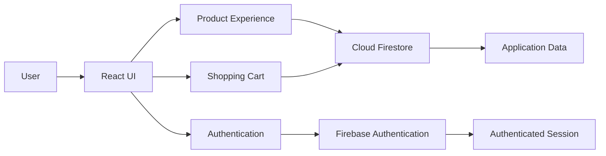

<p align="center">
  
</p>

<div align="center">

# Turkcell Pasaj E-Commerce Frontend

### React + TypeScript E-Commerce Portfolio Project

An unofficial e-commerce frontend project inspired by Turkcell Pasaj, built with React, TypeScript, Tailwind CSS and Firebase.

<br>

[](https://turkcell-pasaj-frontend.vercel.app)
[](https://react.dev/)
[](https://www.typescriptlang.org/)
[](https://firebase.google.com/)

</div>

---

## Overview

This project is a modern e-commerce frontend application inspired by the Turkcell Pasaj shopping experience.

It demonstrates practical frontend engineering with React and TypeScript while integrating Firebase Authentication and Firestore for application data and user-related functionality.

The project focuses on responsive UI development, reusable components, product discovery, authentication and shopping cart workflows.

> This is an independent portfolio project created for educational and demonstration purposes. It is not an official Turkcell product and is not affiliated with Turkcell.

---

## Live Demo

**Application:**  
https://turkcell-pasaj-frontend.vercel.app

---

## Key Features

- Product listing interface
- Product category filtering
- Product discovery workflows
- Firebase Authentication
- Firestore database integration
- Shopping cart management
- Real-time application data handling
- Responsive layout
- Reusable React components
- Type-safe frontend development
- Modern Tailwind CSS styling
- Vercel deployment
- Vitest testing configuration

---

## Tech Stack

| Area | Technology |
|---|---|
| Frontend | React |
| Language | TypeScript |
| Styling | Tailwind CSS |
| Authentication | Firebase Authentication |
| Database | Cloud Firestore |
| Testing | Vitest |
| Deployment | Vercel |
| Package Management | npm |

---

## Application Architecture



---

## Core Areas

### Product Experience

The application provides an e-commerce oriented product browsing experience with reusable UI components and category-based discovery.

### Authentication

Firebase Authentication is used to handle user authentication and authenticated application flows.

### Firestore Integration

Cloud Firestore provides the application's database layer and enables data-driven frontend functionality.

### Shopping Cart

The application includes cart management functionality designed around common e-commerce user flows.

### Responsive Interface

The interface is built with Tailwind CSS and designed to adapt to different screen sizes.

---

## Project Structure

```text
Turkcell_Pasaj_Frontend
├── public
├── src
├── package.json
├── package-lock.json
├── postcss.config.js
├── tailwind.config.js
├── tsconfig.json
└── vitest.config.ts
```

---

## Getting Started

### Requirements

- Node.js
- npm
- Firebase project configuration

### Clone the Repository

```bash
git clone https://github.com/emircankaradeniz/Turkcell_Pasaj_Frontend.git
cd Turkcell_Pasaj_Frontend
```

### Install Dependencies

```bash
npm install
```

### Start Development Server

```bash
npm run dev
```

If the project uses a different development script in the current package configuration, run the script defined in `package.json`.

---

## Firebase Configuration

The application requires Firebase configuration for services such as Authentication and Firestore.

Sensitive Firebase or environment configuration should not be committed directly to the repository.

Use environment variables or the configuration method appropriate for the project setup.

Example structure:

```text
VITE_FIREBASE_API_KEY
VITE_FIREBASE_AUTH_DOMAIN
VITE_FIREBASE_PROJECT_ID
VITE_FIREBASE_STORAGE_BUCKET
VITE_FIREBASE_MESSAGING_SENDER_ID
VITE_FIREBASE_APP_ID
```

---

## What This Project Demonstrates

This project highlights experience with:

- React application development
- TypeScript
- Component-based frontend architecture
- Responsive UI development
- Tailwind CSS
- Firebase Authentication
- Cloud Firestore
- E-commerce user flows
- Shopping cart functionality
- Frontend deployment
- Modern JavaScript tooling

---

## Future Improvements

Potential improvements include:

- Product detail enhancements
- Favorites / wishlist support
- Advanced search and filtering
- Checkout workflow
- Order history
- Improved automated test coverage
- Performance optimization
- Accessibility improvements

---

## Author

**Emircan Karadeniz**

[](https://www.linkedin.com/in/emircankaradeniz/)
[](https://github.com/emircankaradeniz)

---

<div align="center">

### Built with React, TypeScript, Tailwind CSS and Firebase.

</div>
